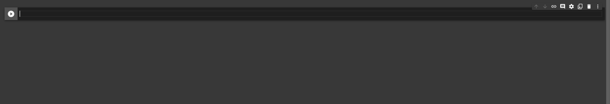

# Utiliser Google Colab pour faire du Machine Learning

Google Colab est un service de Google qui permet d'utiliser des machines virtuelles avec des ressources GPU et TPU pour faire du Machine Learning. Il est possible d'utiliser ces machines gratuitement.

Ces machines ont deja des librairies comme Numpy, matplotlib,Tensorflow, Pytorch, Keras, etc. d'installées.

Cela evite de devoir installer des librairies sur sa machine et de devoir configurer les environnements virtuels.

## Crée un google colab

Pour créer un google colab, il faut aller sur le site [colab.research.google.com](colab.research.google.com) et cliquer sur le bouton "Nouveau notebook".

## Visuel de l'interface

  

Une cellule est une zone de code. Il est possible d'executer une cellule en cliquant sur le bouton "Exécuter" ou en appuyant sur Ctrl+Entrée.

Pour les exemple nous allons utiliser des varibles random pour illustrer les fonctionnalités de Google Colab. Si vous voulez importer des données, il suffit de les [importer](https://medium.com/@simonprdhm/2-mani%C3%A8res-simple-de-charger-un-fichier-csv-dans-google-colab-3b86616d248a#:~:text=On%20vous%20demandera%20de%20s%C3%A9lectionner,que%20Colab%20l'aura%20t%C3%A9l%C3%A9charg%C3%A9.)
Je vous conseille de lire cet article pour comprendre comment importer des données dans Google Colab. (La methode 2 est la plus simple)

(je vous conseille de regarder la librairie [Pandas](https://pandas.pydata.org/getting_started.html) pour manipuler les données. (La function pd.read_csv permet de lire un fichier csv))) 

## Visualisatin des données

Pour visualiser les données, il suffit d'utiliser la librairie [matplotlib](https://matplotlib.org/stable/tutorials/index.html).
Matplotlib est une librairie qui permet de faire des graphiques. Elle est deja installée sur Google Colab.

```python
import numpy as np
from matplotlib import pyplot as plt

ys = 200 + np.random.randn(100)
x = [x for x in range(len(ys))]

plt.plot(x, ys, '-')
plt.fill_between(x, ys, 195, where=(ys > 195), facecolor='g', alpha=0.6)

plt.title("Sample Visualization")
plt.show()
```

Cette cellule va générer un graphique avec des données random. 

Il y a plein de type de plot vous permettant de visualiser vos données. Vous pouvez trouver la liste des plots [ici](https://matplotlib.org/stable/gallery/index.html).

## Crée votre premier modèle 

Pour créer votre premier modèle, il suffit d'utiliser la librairie [Tensorflow](https://www.tensorflow.org/tutorials/quickstart/beginner?hl=fr).

Ce tutoriel va vous permettre de créer un modèle de classification d'images. Il va vous permettre de comprendre comment fonctionne Tensorflow.

En utilisant le dataset [MNIST](http://yann.lecun.com/exdb/mnist/), Il va vous permettre de créer un modèle qui va reconnaitre des chiffres écrits à la main.

Puis vous allez crée un modèle avec Tensorflow 

## Conclusion

Google Colab est un service qui permet de faire du Machine Learning sans avoir à installer des librairies sur sa machine. Il est possible d'utiliser des ressources GPU et TPU gratuitement.

Pour allez plus loin, je vous conseille d'utilisé [Kaggle](https://www.kaggle.com/) qui est un site qui permet de faire des compétitions de Machine Learning. Il est possible de télécharger des datasets et de les utiliser pour faire des modèles. Il est possible de partager ses modèles et de les soumettre à des compétitions.

Grace au Dataset de Kaggle vous pourrez utiliser Pandas pour manipuler les données et Matplotlib pour visualiser les données puis pour finir Tensorflow pour crée votre modèle.

## Sources

  * [Google Colab](https://colab.research.google.com/notebooks/intro.ipynb?utm_source=scs-index)
  * [Tensorflow](https://www.tensorflow.org/tutorials/quickstart/beginner?hl=fr)
  * [Pandas](https://pandas.pydata.org/getting_started.html)
  * [Matplotlib](https://matplotlib.org/stable/tutorials/index.html)
  * [Kaggle](https://www.kaggle.com/)